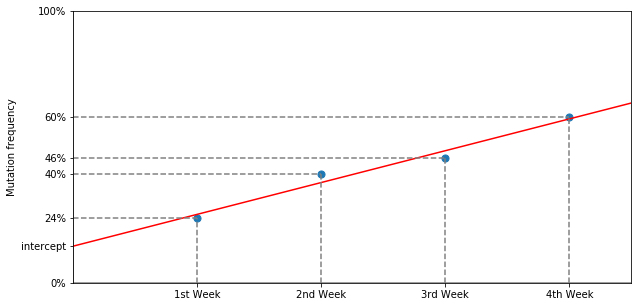

# Docker VariantHunter

## Install and Run

Prerequisites:
- the user must have installed Docker Desktop (https://www.docker.com/products/docker-desktop)

- the user must have a .tsv file with sequences' metadata from GISAID. This can be retrieved, e.g., by logging to https://www.gisaid.org/ and downloading the 'metadata' file from Download packages menu. Here follows the expected header with one example line: 

| Virus name | Type | Accession ID* | Collection date* | Location* | Additional location information | Sequence length | Host | Patient age | Gender | Clade | Pango lineage* | Pangolin version | Variant | AA Substitutions* | Submission date | Is reference? | Is complete? | Is high coverage? | Is low coverage? | N-Content | GC-Content
| --- | --- | --- | --- |--- | --- | --- | --- | --- | --- | --- | --- | --- | --- | --- | --- | --- | --- | --- | --- | --- | --- |
hCoV-19/Italy/XXX/2020 | betacoronavirus | EPI_ISL_XXXXXX | 2020-01-01 | Europe / Italy / Italy |  | 29903 | Human | unknown | unknown | G | B.1 | 2021-01-01 |  | (NSP15_A283V,NSP12_P323L,Spike_D614G) | 2020-04-17 |  | True | True |  | 0.0068649119282 | 0.379674275888 |

(*)These headers are mandatory.

How to start VariantHunter:
1) Download the `docker-compose.yml` file.

2) Open terminal.

3) In terminal, go to the directory of the `docker-compose.yml` file.

4) Run the command: `FILE_PATH=/path_of_directory_of_tsv FILE_NAME=name.tsv LOCATION=place DATE=date docker-compose up`, where:

  - FILE_PATH is the path of the directory that contains the .tsv previously downloaded from GISAID.
  - FILE_NAME is the name of the .tsv file.
  - LOCATION is a name of a place used to filter the .tsv file. The database will contain only sequences from the selected location (e.g. 'Italy'). To apply no filter fill this field with 'world'.
  - DATE is a starting date used to filter the .tsv (e.g. '2021-01-01'). The database will contain only sequences with 'collection_date' > date.

5) Wait until the process finishes to insert all the data in the database (big .tsv files ~5GB could require a few hours).

6) When the log on the terminal shows the message `* Running on http://0.0.0.0:5000/ (Press CTRL+C to quit)`, the database has been loaded and the application can be opened in a browser using the following URL: http://localhost:5000/variant_hunter/.

The process can be stopped with CTRL+C; it can be restarted using the same or a new .tsv file, requiring to rerun the whole upload.

## Analyses
VariantHunter analyzes the frequencies of aminoacid mutations of SARS-CoV-2 in order to spot novel emerging variants.

VariantHunter supports two types of analyses: *Lineage Agnostic* and *Lineage Aware*.

The underlying mechanism of both the metodology is the same: each AA mutation is analyzed for a time period of 4 weeks. For each week the frequency of the mutation (computed as "number of sequencing harboring the mutations"/"total number of sequences") is considered (the four blue dots in the above figure); then, a linear model is fitted on the four data points (red line in the figure). The slope of the regression line represent *how fast* the mutations is growing (i.e., its percentage is increasing). Positive slopes indicate and increasing trend, while negative values of the slope indicates a decreasing trend.

Finally, *chi squared* tests are computed to test the significance of the change of frequency of the mutation.

The main results of both analysis is a table listing relevant mutations; further details are provided below.

### Lineage Agnostic

